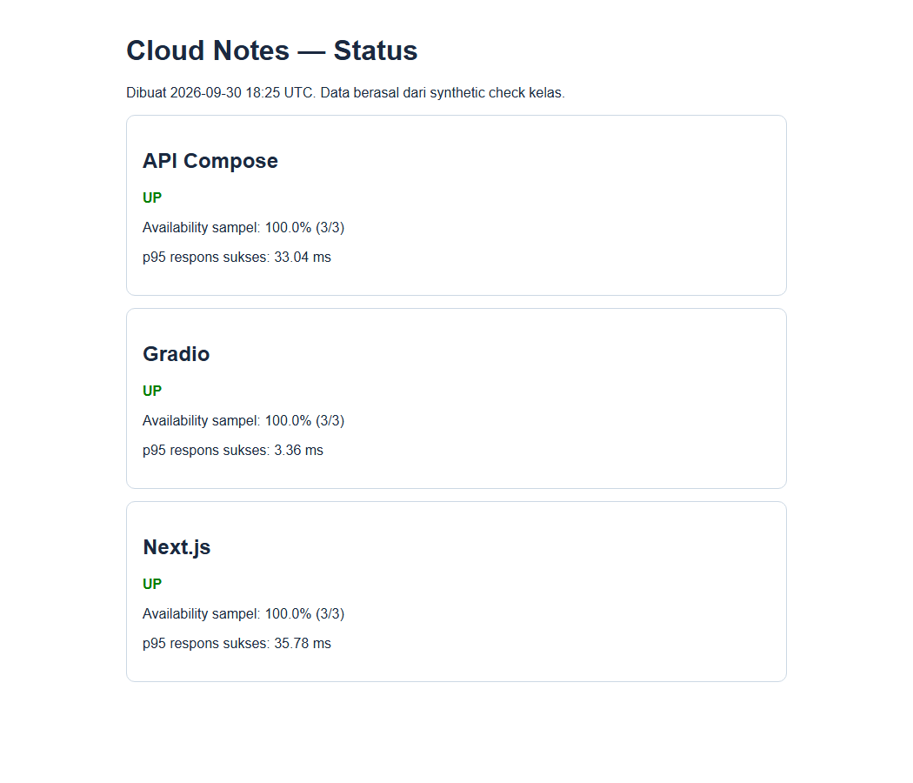
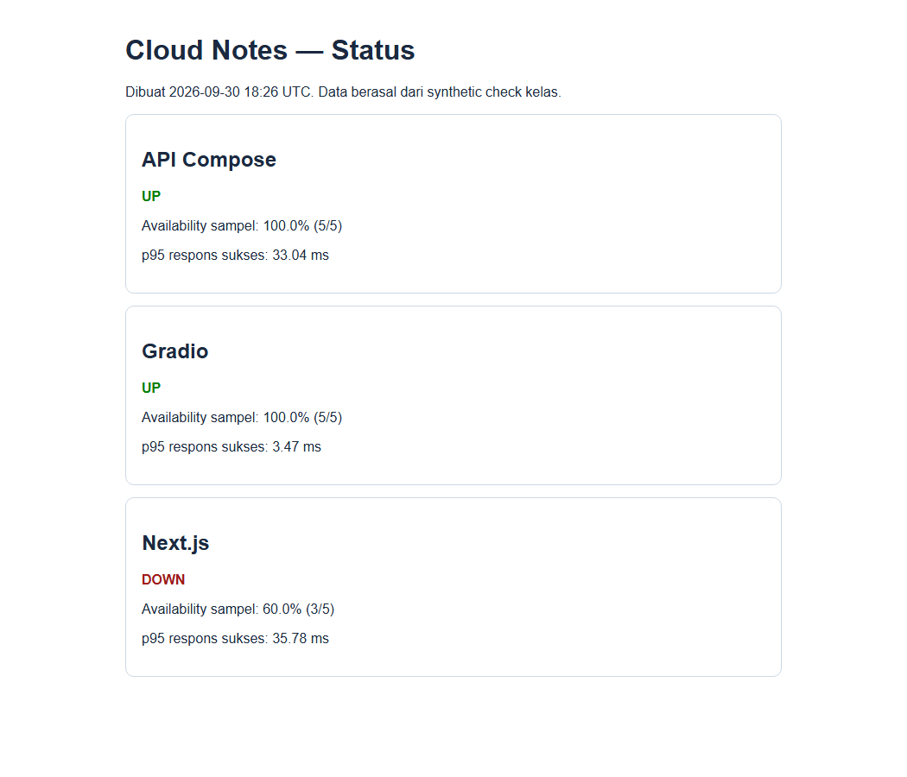

# Modul Mahasiswa Lab 10 — Monitoring dan SLI/SLO

**Kebijakan kelas:** Lab ini latihan formatif, tanpa tugas, nilai, atau penyerahan terpisah. Satu proyek besar dikerjakan oleh kelompok **3 orang**, dengan presentasi checkpoint minggu 7 (UTS) dan hasil akhir minggu 14 (UAS). Simpan hasil lab hanya bila berguna sebagai referensi atau bukti proses proyek. Baca [brief proyek kelompok](PROYEK_KELOMPOK.md). Bobot resmi tetap mengikuti RPS/LMS.

**Sesi RPS:** 10 · **Mode utama:** Python lokal · **Bukti latihan opsional untuk proyek:** log probe, perhitungan, status page, analisis gangguan, dan commit Git.

**Jenis bukti visual:** status page UP, DOWN, dan pulih adalah screenshot browser nyata dari simulasi tiga layanan. Gambar terminal/log berlatar gelap menata ulang teks keluaran uji agar terbaca; itu bukan screenshot terminal langsung. Mahasiswa tetap perlu mengambil bukti dari run sendiri.

## Tujuan dan konsep

Anda akan memeriksa tiga service Cloud Notes secara berkala: Next.js Lab 08, API Lab 06, dan Gradio Lab 09. `monitor.py` menyimpan waktu, status, serta latensi setiap probe sebagai JSON Lines; `report.py` menghitung availability dan p95; `status.py` membuat halaman HTML. Ini adalah *synthetic check* dari satu mesin, bukan bukti uptime produksi.

Jalankan `monitor.py` untuk pemeriksaan layanan pada repositori ini. Contoh `healthcheck.py` di slide sesi 10 adalah sketsa konsep; tiga script yang dipakai kelas tercantum pada langkah berikut.

## Persiapan

Jalankan Lab 06 di port 8000, Lab 08 di port 3000, dan Lab 09 di port 7860. Pastikan endpoint yang ditetapkan pada `targets.local.json` dapat diakses dari terminal tempat monitor berjalan. Python standard library cukup untuk script monitor; tidak perlu akun cloud.

Dari root repo Lab 10:

```bash
python monitor.py --count 5 --interval 3 --reset
python report.py
python status.py
```

Buka `status.html` di browser. Di Windows, jalankan `Start-Process .\status.html` bila perlu; di Linux/macOS buka file dengan browser biasa. `--reset` hanya menimpa `observations.jsonl` untuk memulai sampel baru; jalankan tanpa opsi itu saat menambahkan data gangguan. Catat lima check per target, jumlah UP, availability, dan p95 respons sukses. Untuk berkas terpisah, gunakan `--output observations-baru.jsonl` dan teruskan nama berkas yang sama ke `report.py` serta `status.py`. Keluaran lokal ini diabaikan Git.

## Praktik bertahap

1. **Telusuri konfigurasi.** Buka `targets.local.json`. Cocokkan nama target dan endpoint health pada masing-masing lab. Jangan mengirim token lewat query string URL.
2. **Amati data mentah.** Buka `observations.jsonl` dan cari `timestamp`, `ok`, `status`, `latency_ms`, `error`. Bandingkan dengan baris ringkasan `report.py`.
3. **Simulasikan gangguan.** Hentikan **hanya server Next lokal Anda** dengan `Ctrl+C`. Biarkan API dan Gradio tetap berjalan, lalu dari root repo Lab 10 jalankan:

```bash
python monitor.py --count 2 --interval 1
python report.py
python status.py
```

4. **Baca perubahan.** Target Next seharusnya berstatus terakhir **DOWN**; dua target lain tetap UP. Karena file JSONL yang sama ditambah terus, availability di laporan mencakup check sebelum dan sesudah gangguan, sehingga tidak harus 0%. Nyalakan Next kembali setelah pengamatan.
5. **Hubungkan log.** Buat request catatan melalui Lab 08 dan lihat satu baris log JSON server yang memuat `requestId`, `event`/`level`, dan `durationMs`. Pada request yang berhasil, log `notes_proxy` juga memuat `status` HTTP. Bandingkan log per-request dengan probe uptime dan p95.

### Tampilan pada setiap langkah

**Langkah 1 dan 4 — target serta perhitungan.** Bagian atas memperlihatkan URL health yang dicek; bagian bawah menyajikan ulang ringkasan kumulatif setelah sampel UP dan DOWN pada mesin uji. Ini visualisasi transkrip aktual, bukan tangkapan layar terminal langsung.


* **Langkah:** Jalankan `python monitor.py --count 5 --interval 3`, lalu `python report.py` dari root repo Lab 10. **Fungsi:** Menghubungkan URL target dengan ringkasan probe. **Cara kerja:** Monitor menulis status/durasi setiap health check ke JSONL; report menghitung availability dan p95 sampel. **Baca hasil:** Cocokkan tiga target dengan jumlah UP/DOWN dan p95; lima probe hanya contoh kelas.

**Langkah 2 — web status saat UP.** Ketiga target merespons pada putaran pertama. Angka pada mesin Anda dapat berbeda.



* **Langkah:** Setelah probe berhasil, jalankan `python status.py` dan buka HTML status yang dihasilkan. **Fungsi:** Melihat kesehatan terakhir tiap target dalam UI. **Cara kerja:** Status page membaca observasi JSONL dan mewarnai kartu menurut hasil terbaru. **Baca hasil:** Ketiga kartu harus UP; cek timestamp agar tidak membaca laporan lama.

**Langkah 3 — web status setelah gangguan.** Hanya Next lokal dihentikan; kartu Next menjadi DOWN sedangkan target lain tetap UP.



* **Langkah:** Hentikan hanya Next.js lokal, ulangi `python monitor.py --count 2 --interval 1`, lalu `python status.py`. **Fungsi:** Mensimulasikan gangguan dan menguji perubahan status. **Cara kerja:** Probe Next gagal sementara target lain tetap merespons; HTML memakai hasil terakhir per target. **Baca hasil:** Kartu Next menjadi DOWN, target lain UP; cocokkan dengan URL dan waktu probe.

**Langkah 4 — pemulihan.** Nyalakan lagi `npm run dev` Lab 08, jalankan `python monitor.py --count 1 --interval 1`, lalu `python status.py`. Gambar berikut berasal dari urutan uji 3 probe sehat, 2 gagal, dan 1 pulih pada tiga layanan nyata.


* **Langkah:** Start Next lagi dan tambahkan satu probe tanpa `--reset`. **Fungsi:** Memisahkan status terbaru dari availability historis. **Cara kerja:** `monitor.py` menambahkan satu baris sukses; `status.py` membuat ulang snapshot dari seluruh JSONL. **Baca hasil:** Next kembali **UP**, tetapi baru 4/6 atau 66,67% dan budget -1,94; API serta Gradio 6/6.

**Langkah 5 — log server.** Ini satu baris log nyata dari percobaan `GET /api/notes` saat backend Lab 06 dimatikan. Pada jalur error ini terlihat `level=error` dan `event=notes_proxy_unavailable`, tanpa field `status` HTTP. Bandingkan `requestId` dan durasi dengan hasil probe, lalu ulangi pada request catatan milik Anda.


* **Langkah:** Saat backend Lab 06 sengaja mati, kirim GET `/api/notes` ke Next.js lalu lihat log terminal server. **Fungsi:** Menghubungkan kegagalan proxy dengan observabilitas request. **Cara kerja:** Logger menulis JSON `level`, `event`, `requestId`, dan `durationMs` tanpa isi catatan. **Baca hasil:** Cari `notes_proxy_unavailable` dan requestId; pada jalur error contoh tidak ada field status HTTP.

## Pertanyaan untuk laporan

1. Hitung availability dari jumlah UP dan total check untuk satu target. Mengapa lima probe belum cukup untuk mengklaim SLO produksi?
2. Mengapa p95 dihitung hanya dari respons yang berhasil? Apa informasi tambahan yang diperlukan untuk memahami kegagalan?
3. Apa perbedaan metric, log, dan trace pada alur satu catatan?
4. Jika SLO ditetapkan 99% selama periode tertentu, bagaimana satu kegagalan memengaruhi *error budget* pada sampel yang sangat kecil?

## Bukti dan Git

Salin [template laporan](hasil/TEMPLATE_LAPORAN.md) menjadi `hasil/lab10.md`. Sertakan tabel UP/DOWN, perhitungan availability/p95, screenshot status **hasil Anda sendiri**, satu baris log JSON yang sudah dicek aman, dan jawaban pertanyaan. `observations.jsonl` serta `status.html` adalah hasil lokal yang diabaikan Git; masukkan ringkasan dan screenshot aman ke laporan, bukan file operasi mentah.

Dari root repo Lab 10:

```bash
git status --short
git add .
git diff --cached --name-only
git diff --cached --check
git commit -m "lab10: synthetic monitor dan analisis slo"
git push
```

Simpan bukti milik Anda di `hasil/bukti/` bila ada; laporan tetap perlu memuat bukti hasil sendiri. Jangan commit webhook Discord, URL internal yang sensitif, atau data pengguna. Baca [panduan Git](PANDUAN_GIT.md).

## Jalur cloud dan kendala

`targets.cloud.example.json` adalah contoh untuk URL publik; salin ke file lokal dan sesuaikan jika akun/layanan tersedia. Webhook Discord opsional hanya melalui environment variable/secret. Jika target DOWN padahal aplikasi berjalan, periksa URL, port, firewall, dan apakah Space sedang tidur. Hasil `status.html` adalah snapshot saat script dijalankan, bukan halaman yang otomatis memperbarui diri. Setelah lab, hentikan service sesuai panduan masing-masing lab.

## Challenge kerja sehari-hari: laporan insiden tiga layanan — kunci lengkap

Anda bertugas memantau web [Lab 08](https://github.com/SeedFlora/meet8CloudService), API [Lab 06](https://github.com/SeedFlora/meet6CloudService), dan Gradio [Lab 09](https://github.com/SeedFlora/meet9CloudService). Ketiganya harus hidup pada **host/Codespace yang sama** untuk URL pada `targets.local.json`. Repo ini berisi monitor saja; clone repo layanan yang diperlukan di folder terpisah. Jika hanya ingin menguji kode monitor tanpa ketiga layanan, langkah 7 memakai server lokal kecil otomatis.

1. **Periksa target.** Jalankan `Get-Content .\targets.local.json` (PowerShell) atau `cat targets.local.json` (Bash). Kunci: Next `/api/health` port 3000, API `/health` port 8000, Gradio `/` port 7860. Nama target harus unik; konfigurasi dengan nama duplikat atau URL yang mengandung user/password ditolak.
2. **Ambil baseline.** Jalankan `python monitor.py --count 3 --interval 1 --reset`, `python report.py`, `python status.py`. Kunci bila semua sehat: tiga kartu **UP**, masing-masing 3/3 atau 100% pada sampel itu. `--reset` hanya digunakan pertama kali agar baris kelas sebelumnya tidak tercampur.
3. **Baca ukuran.** `observations.jsonl` berisi satu JSON per target per putaran, jadi 3 putaran × 3 target = 9 baris. `report.py` menghitung availability = jumlah `ok=true` / jumlah check × 100%. p95 memakai nearest-rank dari latensi respons sukses saja. `error_budget_checks` menyatakan sisa jatah kegagalan; nilai negatif menunjukkan anggaran SLO telah terlampaui pada sampel itu.
4. **Ciptakan gangguan terkendali.** Hentikan **hanya** `npm run dev` Lab 08 dengan `Ctrl+C`, jangan matikan Compose atau Gradio. Dari repo ini jalankan `python monitor.py --count 2 --interval 1` tanpa `--reset`, lalu `python report.py` dan `python status.py`. Kunci uji lokal: Next terakhir **DOWN**, API dan Gradio tetap **UP**. Jika baseline 3/3 dan dua probe berikutnya gagal, Next menjadi 3/5 = **60%**, budget 99% untuk lima check adalah 0,05, dua kegagalan menghabiskan 2, sisa **-1,95 check**. Nilai latensi tiap mesin berbeda.
5. **Pulihkan dan amati.** Hidupkan `npm run dev` Lab 08 kembali. Ulangi satu probe tanpa `--reset`. Status Next terakhir kembali UP, tetapi availability kumulatif belum kembali 100%; kegagalan historis tetap dihitung. Halaman `status.html` perlu dibuat lagi dengan `python status.py` karena ini snapshot statis.
6. **Hubungkan log.** Buat satu catatan melalui Lab 08. Periksa baris JSON `notes_proxy` di terminal Next dan header `X-Request-ID` pada respons API. Kunci: ID sama mempermudah korelasi satu request; monitor memberi status/latensi berkala untuk target, bukan trace penuh. Jangan tempelkan isi catatan ke log.
7. **Jalankan checker mandiri.** `python -B tests/challenge.py` pada PowerShell/Bash. Kunci **9 PASS, 0 FAIL**. Checker membuat server HTTP sementara pada port bebas, menguji HTTP 200/503, empat observasi, availability, budget negatif, status HTML, escaping, dan validasi target duplikat. Tidak perlu akun atau tiga service lain untuk checker ini.


*Perintah/tindakan:* `python monitor.py --count 3 --interval 1 --reset`, `python report.py`, `python status.py`, lalu buka HTML. *Fungsi:* membuat baseline. *Cara kerja:* tiga URL diperiksa tiap putaran, hasil JSONL diringkas, HTML disusun dari hasil terakhir. *Baca hasil:* tiga kartu UP dan 100% pada sampel tiga check.


*Perintah/tindakan:* hentikan Next, jalankan `python monitor.py --count 2 --interval 1` lalu `python status.py`. *Fungsi:* menguji deteksi gangguan terisolasi. *Cara kerja:* dua baris DOWN baru ditambahkan hanya untuk target Next, lalu snapshot HTML diperbarui. *Baca hasil:* Next DOWN, 3/5 atau 60%, budget -1,95; API dan Gradio UP.


*Perintah/tindakan:* hidupkan `npm run dev` Lab 08 lagi, jalankan `python monitor.py --count 1 --interval 1` tanpa `--reset`, lalu `python status.py` dan buka ulang `status.html`. *Fungsi:* menguji pemulihan tanpa menghapus histori insiden. *Cara kerja:* satu keberhasilan baru ditambahkan pada file JSONL yang sama. *Baca hasil:* Next terakhir UP, tetapi 4/6 = 66,67% dan budget -1,94 karena dua kegagalan sebelumnya tetap tersimpan.


*Perintah/tindakan:* `python report.py` setelah 3 probe sehat dan 2 probe gagal untuk Next. *Fungsi:* menghitung SLI/SLO. *Cara kerja:* script mengelompokkan JSONL per target dan menghitung availability, p95 sukses, serta sisa budget. *Baca hasil:* Next 3/5, 60%, -1,95 check; gambar menata ulang JSON aktual agar terbaca, bukan tangkapan layar terminal langsung.


*Perintah/tindakan:* `python -B tests/challenge.py`. *Fungsi:* mengecek kode monitor tanpa tiga service eksternal. *Cara kerja:* test menyalakan HTTP server sementara dan menyimulasikan UP/DOWN. *Baca hasil:* 9 PASS, 0 FAIL; output aktual ditata ulang untuk modul, bukan tangkapan layar terminal langsung.

### Jawaban pertanyaan laporan

1. Availability contoh Next setelah kasus di atas ialah 3/5 × 100% = 60%. Lima probe dalam beberapa detik tidak mewakili periode SLO produksi, variasi traffic, lokasi pengguna, atau durasi gangguan.
2. p95 dari respons sukses menggambarkan kecepatan ketika layanan menjawab; request gagal tidak memiliki latensi sukses yang sebanding. Laporkan juga jumlah error, tipe/status error, timeout, dan distribusi waktu kegagalan.
3. Metric merangkum angka seperti availability/p95; log mencatat peristiwa satu request (`requestId`, status, durasi); trace mengikuti satu permintaan melintasi beberapa layanan/spans. Monitor kelas mengumpulkan metric sederhana dan log Next, belum instrumentasi trace terdistribusi.
4. Budget 99% pada 5 check hanya 0,05 kegagalan; satu kegagalan sudah membuat sisa 0,05 − 1 = **-0,95 check**. Angka pecahan ini ilustrasi matematika, bukan kebijakan produksi; gunakan periode dan denominator yang jelas untuk SLO sungguhan.
