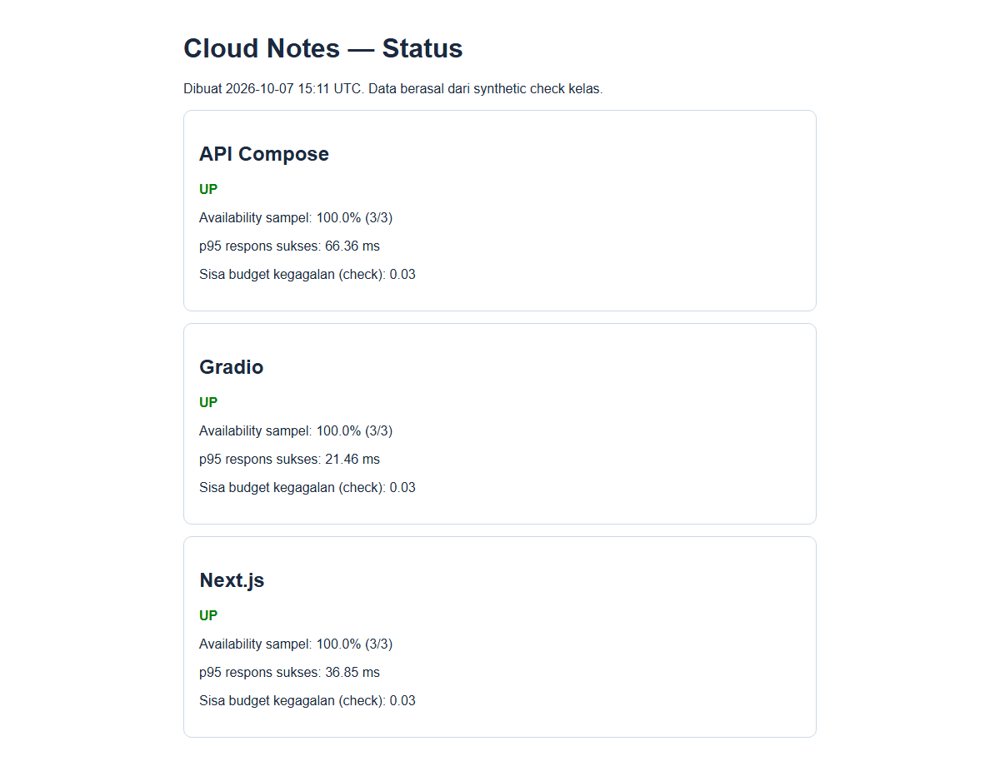
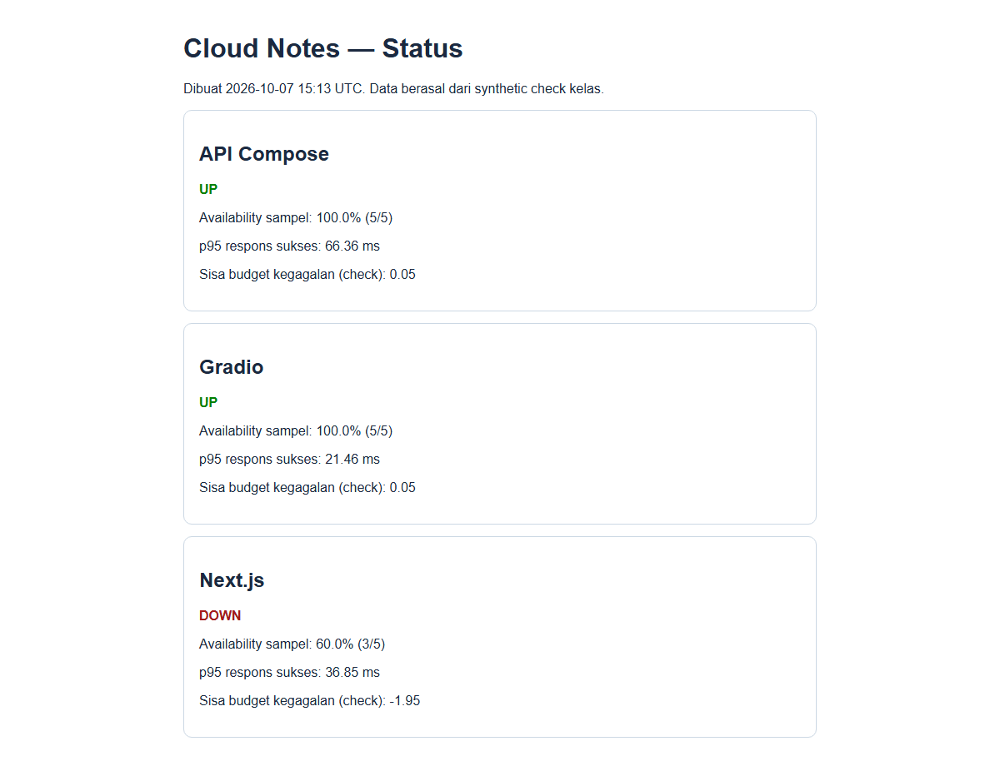
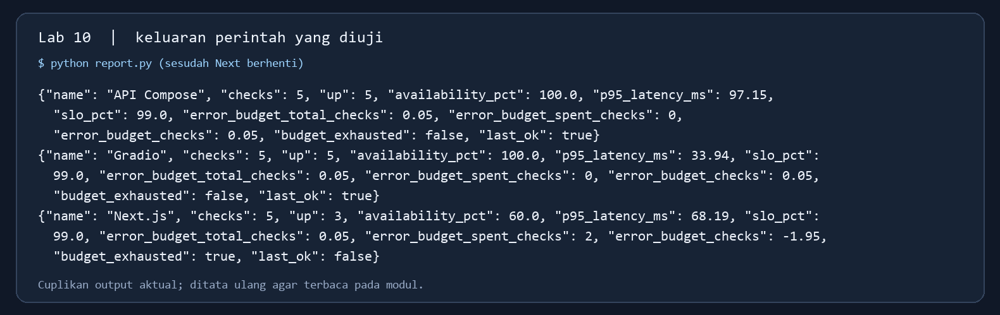
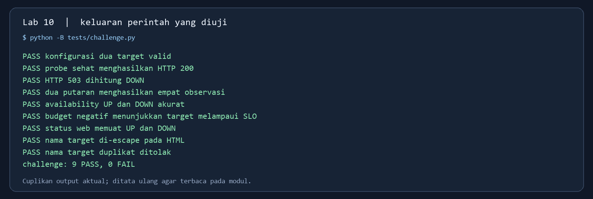
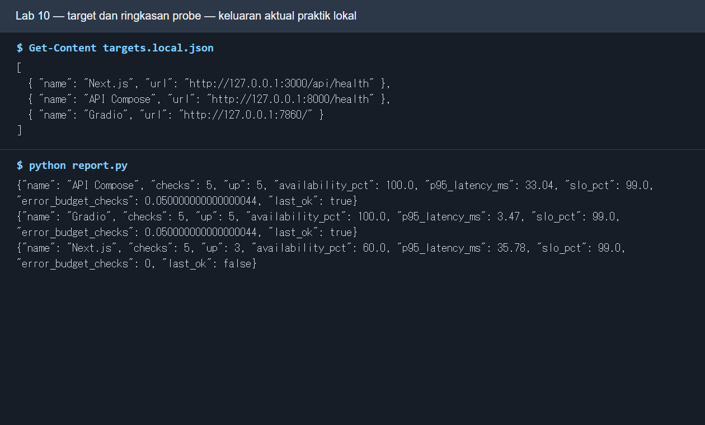
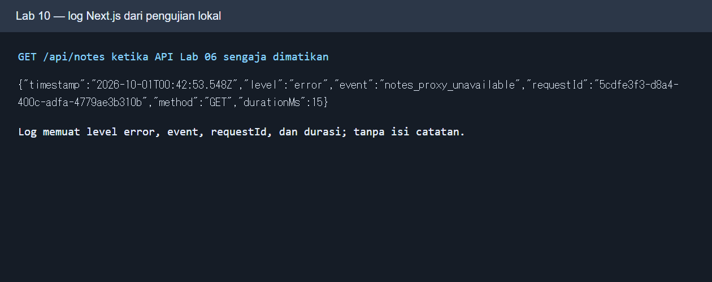

# Panduan Dosen Lab 10 — Monitoring, log, dan SLO

**Repo materi:** `SeedFlora/meet10CloudService` · **durasi contoh:** 100 menit · **jalur utama:** Python standard library. Untuk kasus tiga layanan, hidupkan [Lab 06](https://github.com/SeedFlora/meet6CloudService), [Lab 08](https://github.com/SeedFlora/meet8CloudService), dan [Lab 09](https://github.com/SeedFlora/meet9CloudService) pada satu komputer/Codespace. Checker mandiri tetap dapat berjalan tanpa ketiga layanan.

**Jenis bukti visual:** halaman status UP, DOWN, dan pemulihan adalah screenshot browser dari simulasi nyata. Gambar keluaran terminal/log berlatar gelap adalah visualisasi transkrip uji yang ditata ulang, bukan screenshot terminal langsung.

## Hasil belajar dan alasan kasus

Mahasiswa mengoperasikan synthetic monitor, membaca JSONL, menghitung availability dan p95, membuat halaman status, menyimulasikan gangguan, serta menghubungkan metric dengan log request. Kasus kerja: tim operasi melihat web tidak tersedia, tetapi API dan model sentimen masih hidup. Mereka perlu mengisolasi komponen dan menjelaskan sisa error budget. Tekankan bahwa lima probe dalam hitungan detik bukan dasar klaim SLO produksi.

## Persiapan dosen

1. Dari root repo ini cek `python --version` dan isi `targets.local.json`: Next `/api/health` 3000, API `/health` 8000, Gradio `/` 7860. Ketiga server harus hidup pada mesin yang menjalankan monitor; `localhost` pada Codespace lain berbeda.
2. Coba tiap URL dari terminal. API Lab 06 `/health` memeriksa database dan cache; Next `/api/health` hanya liveness Next. Lab 08 juga menyediakan `/api/ready` untuk memeriksa API Lab 06; diskusikan beda target probe.
3. Jalankan `python -B tests/challenge.py` sebelum kelas. Hasil yang diharapkan **9 PASS, 0 FAIL**. Uji ini membuat server HTTP sementara, tidak membutuhkan cloud atau layanan lain.
4. Jangan set `DISCORD_WEBHOOK_URL` untuk demo wajib. Bila memakai webhook opsional, simpan sebagai environment variable lokal/secret, tidak dalam repo atau screenshot.
5. Siapkan tiga terminal server dan satu terminal monitor. Laporan praktik dari mahasiswa masuk ke `hasil/lab10.md`; lihat [template](hasil/TEMPLATE_LAPORAN.md) dan [panduan Git](PANDUAN_GIT.md).

## Susunan kelas

| Menit | Demonstrasi dosen | Tugas mahasiswa | Hasil yang dibaca |
|---|---|---|---|
| 0–15 | Jelaskan target, probe, JSONL, metric/log/trace. | Buka `targets.local.json`. | URL/port setiap service benar. |
| 15–30 | Jalankan tiga layanan dan baseline monitor. | `python monitor.py --count 3 --interval 1 --reset`. | 9 observasi, semua UP. |
| 30–45 | Jalankan report/status dan hitung manual. | Bandingkan 3/3, p95. | Kartu UP, availability 100%. |
| 45–60 | Hentikan hanya Next Lab 08. | Tambahkan dua probe tanpa `--reset`. | Next DOWN, dua target lain UP. |
| 60–75 | Hitung error budget 99% pada lima check. | Jelaskan 3/5 dan -1,95 check. | Budget negatif berarti terlampaui. |
| 75–85 | Hidupkan Next, jelaskan histori dan snapshot. | Probe ulang, ekspor status lagi. | Status terakhir UP, histori gagal tetap ada. |
| 85–100 | Tunjukkan log `notes_proxy` dan checker. | Jalankan 9 check, isi laporan/Git. | Request ID, status, durasi tanpa isi catatan. |

## Kunci perintah yang ditampilkan di kelas

**Baseline:** dari root repo Lab 10, `python monitor.py --count 3 --interval 1 --reset`, lalu `python report.py` dan `python status.py`. `--reset` membuka `observations.jsonl` baru; tanpa opsi itu monitor menambahkan baris. Tiga target × tiga putaran = sembilan JSON. Jika semuanya sehat, report menunjukkan `checks=3`, `up=3`, `availability_pct=100.0` untuk tiap nama, sedangkan p95 bervariasi menurut mesin. Buka `status.html` memakai browser atau `Start-Process .\status.html` di Windows.

**Gangguan:** stop hanya terminal `npm run dev` Lab 08 dengan `Ctrl+C`. Jalankan `python monitor.py --count 2 --interval 1`, `python report.py`, `python status.py`. Hasil uji lokal nyata: Next 3/5 = 60%, `last_ok=false`, `error_budget_total_checks=0.05`, `error_budget_spent_checks=2`, `error_budget_checks=-1.95`; API dan Gradio tetap 5/5, 100%, `last_ok=true`. Hasil latensi yang diukur pada mesin uji berbeda dari mesin kelas.

**Pemulihan:** jalankan lagi `npm run dev` di repo Lab 08, tambahkan satu putaran monitor tanpa reset. Status terakhir Next menjadi UP, tetapi availability kumulatif tetap di bawah 100% karena observasi gagal tidak dihapus. `status.html` baru berubah setelah `python status.py` dieksekusi lagi.

*Command:* di Lab 08 hidupkan `npm run dev`; di Lab 10 jalankan `python monitor.py --count 1 --interval 1`, `python report.py`, `python status.py`, lalu buka ulang HTML. *Fungsi:* menunjukkan bahwa status terkini dan SLI historis berbeda. *Cara kerja:* satu probe baru ditambahkan ke JSONL lama; halaman status dibangun ulang. *Baca hasil:* Next UP tetapi 4/6 atau 66,67%, budget -1,94; dua service lain 6/6.

**Log:** lakukan GET/POST `/api/notes` di Lab 08. Baris JSON server `notes_proxy` memiliki `timestamp`, `level`, `event`, `requestId`, `method`, `status`, `durationMs`. Header `X-Request-ID` pada respons dapat dicocokkan dengan satu baris log. Pada jalur `notes_proxy_unavailable`, log error tidak punya status upstream. Log tidak berisi judul/isi catatan atau token. Metric p95 per target berbeda dari durasi log satu request.

**Checker mandiri:** `python -B tests/challenge.py` memeriksa config, probe 200/503, penulisan empat observasi, availability UP/DOWN, budget negatif, ekspor HTML, escaping nama target, dan penolakan nama duplikat. **9 PASS, 0 FAIL**. Ini menguji perilaku script tanpa menunggu tiga repo; praktik operasional tiga layanan tetap perlu dilakukan terpisah.

*Command:* `python monitor.py --count 3 --interval 1 --reset; python report.py; python status.py`, kemudian buka HTML. *Fungsi:* membuat baseline. *Cara kerja:* `monitor` menyimpan JSONL, `report` merangkum, `status` menulis snapshot HTML. *Baca hasil:* tiga kartu UP, 3/3.

*Command:* stop Next saja; `python monitor.py --count 2 --interval 1; python report.py; python status.py`. *Fungsi:* mengisolasi gangguan web. *Cara kerja:* dua probe tambahan gagal hanya pada Next, status terakhir dan agregat berubah. *Baca hasil:* Next DOWN 3/5 = 60%, budget -1,95; API/Gradio UP 5/5.

*Command:* `python report.py`. *Fungsi:* membaca angka SLO langsung dari JSONL. *Cara kerja:* report menghitung per target dan mempertahankan budget negatif bila gagal melampaui jatah. *Baca hasil:* Next 3/5, 60%, -1,95; cuplikan JSON aktual ditata ulang, bukan screenshot terminal langsung.

*Command:* `python -B tests/challenge.py`. *Fungsi:* memastikan logika monitor sebelum kelas. *Cara kerja:* server HTTP lokal otomatis menyediakan 200 dan 503, lalu script memeriksa laporan/status. *Baca hasil:* 9 PASS, 0 FAIL; keluaran aktual ditata ulang, bukan screenshot terminal langsung.

## Kunci tanya jawab

1. Availability = jumlah check sukses / total × 100%. Lima check tidak menunjukkan ketersediaan satu bulan, variasi pengguna/lokasi, atau durasi nyata.
2. p95 dihitung dari latensi respons sukses. Perlu jumlah/status error, timeout, interval probe, dan catatan lokasi untuk memahami kegagalan. Kegagalan cepat tetap kegagalan.
3. Metric adalah agregat numerik (availability/p95), log adalah catatan event/request, trace menghubungkan span lintas layanan. Lab ini belum memiliki tracing terdistribusi.
4. Untuk SLO 99% dan 5 check, budget = 0,05 check. Satu kegagalan memberi sisa -0,95; dua memberi -1,95. Pecahan ini ilustrasi skala kecil, bukan kebijakan produksi.

## Rubrik dan kesalahan yang sering terjadi

Nilai target/konfigurasi (15%), baseline & JSONL (20%), insiden/isolasi (25%), perhitungan serta interpretasi SLO (25%), log/Git (15%). Jika semua target DOWN, periksa URL, port, dan apakah terminal server ada di host yang sama. Jika report memuat data kelas kemarin, ulangi baseline dengan `--reset` pada file lokal atau gunakan `--output` baru. Jika hanya Gradio DOWN, tunggu startup UI atau cek port 7860. Jika monitor menampilkan target duplikat/error URL, perbaiki `targets.local.json`; jangan menaruh token pada URL. `status.html` adalah file statis, bukan dashboard yang otomatis menyegarkan. Setelah demo, pulihkan Next dan server lain sebelum kelas berikutnya.

## Bukti visual tambahan untuk demo

*Command:* buka `targets.local.json`, jalankan `python monitor.py --count 3 --interval 1 --reset` dan `python report.py`. *Fungsi:* menghubungkan URL dengan angka target. *Cara kerja:* nama/URL menjadi kunci pengelompokan JSONL. *Baca hasil:* tiga target dan availability/p95; gambar praktik sebelumnya, angka dapat berbeda.

*Command:* GET `/api/notes` saat API Lab 06 mati dan lihat terminal Next. *Fungsi:* membandingkan log per request dengan metric probe. *Cara kerja:* logger mencatat `requestId`, event, dan durasi tanpa isi catatan. *Baca hasil:* `notes_proxy_unavailable`; gambar praktik sebelumnya.
